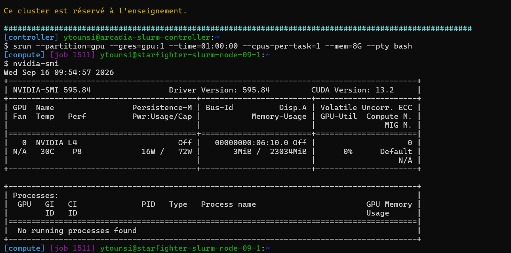
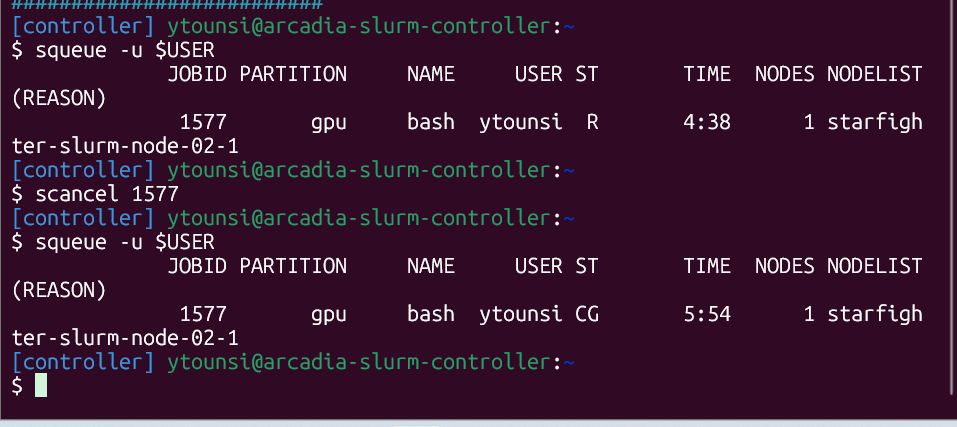
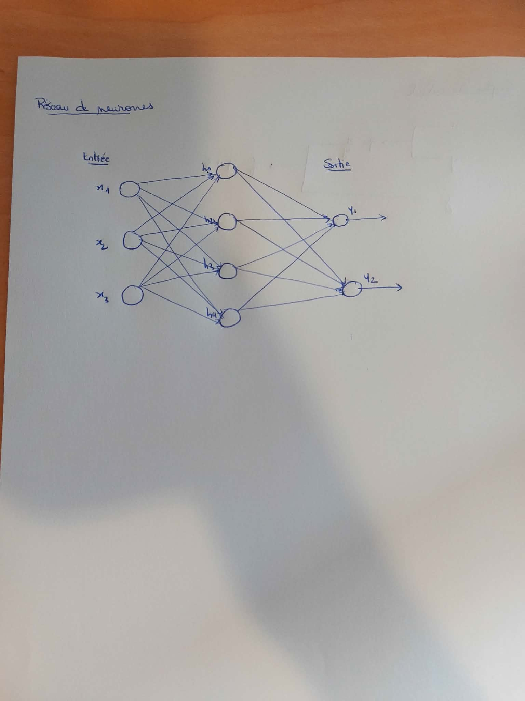
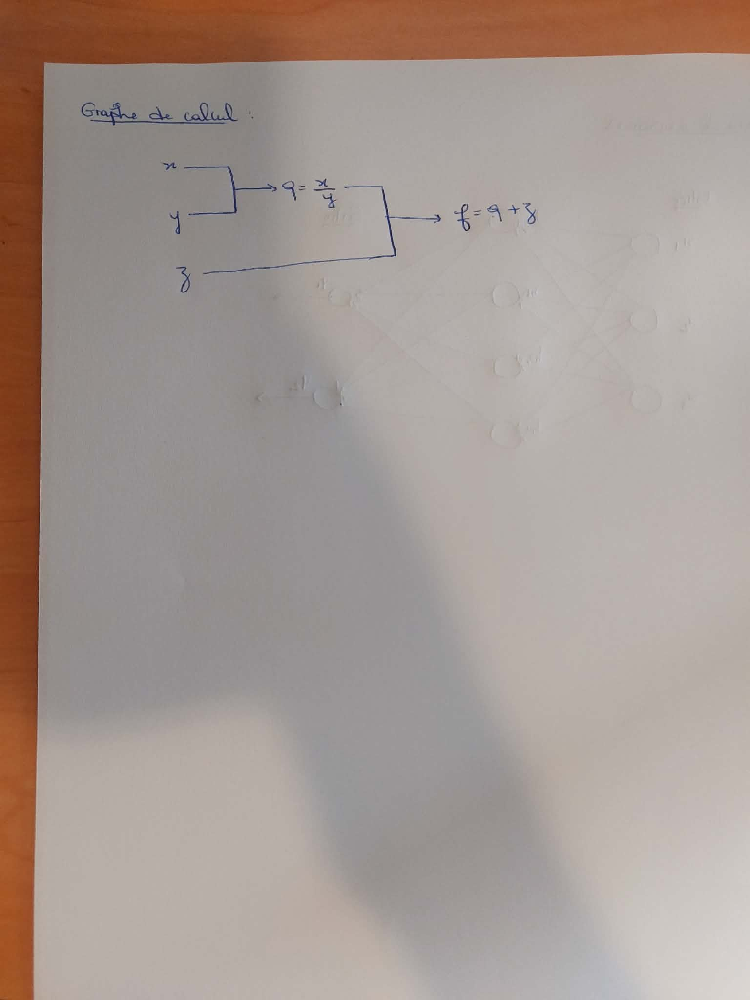
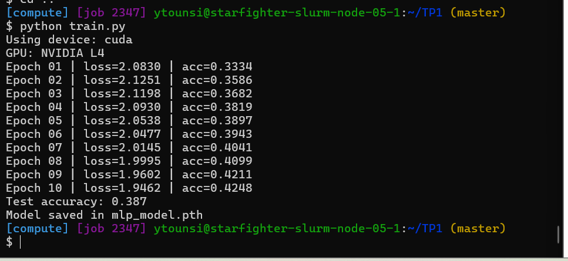
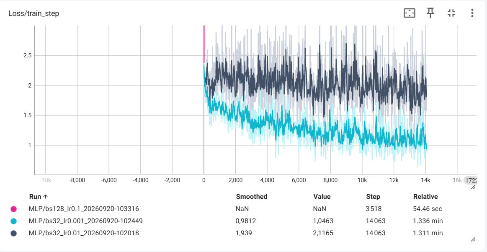
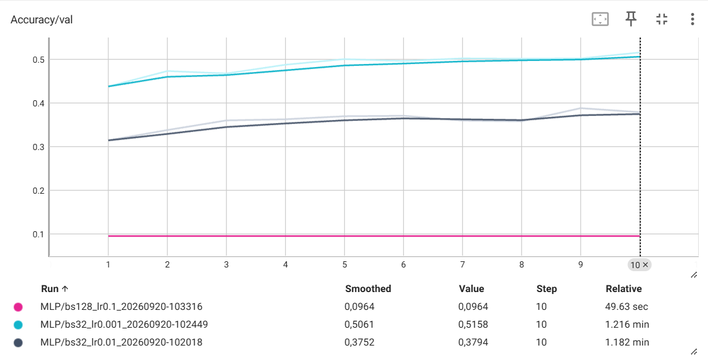
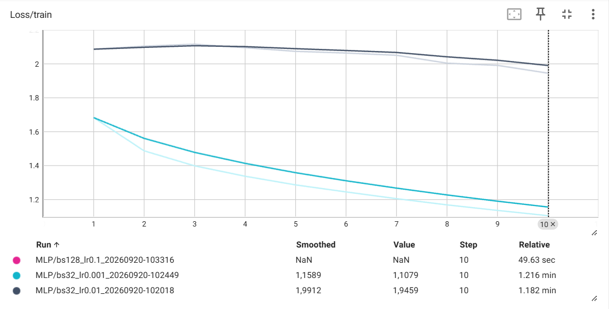
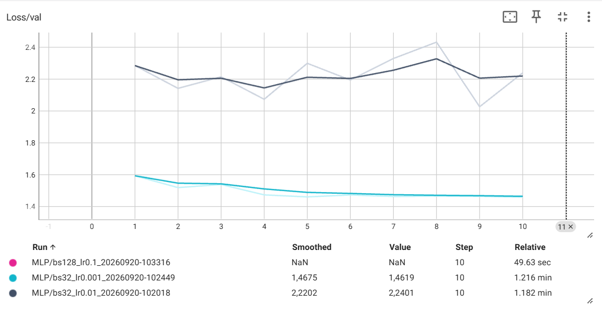

# CSC 8607 — Introduction au Deep Learning

## TP1 — Yasmine TOUNSI

---

## 1. Utilisation de SLURM

### 1.1 GPU alloué

Après avoir obtenu un nœud de calcul avec SLURM, j'ai exécuté la commande :

```bash
nvidia-smi
```

Le modèle exact du GPU qui m'a été alloué est :

**NVIDIA L4**



---

### 1.2 Arrêt d'un job avec `scancel`

Après avoir identifié le JobID avec :

```bash
squeue -u $USER
```

la commande exacte utilisée pour annuler mon job était :

```bash
scancel 1577
```



---

### 1.3 Soumission d'un job avec `sbatch`

Après avoir exécuté :

```bash
sbatch hello.sh
```

le fichier de log généré dans le dossier `logs/` était :

```text
hello-slurm-1577.out
```

---

### 1.4 `ReqMem` et `MaxRSS`

`ReqMem` représente la quantité de mémoire demandée à SLURM lors de la soumission du job.

`MaxRSS` représente la quantité maximale de mémoire vive réellement utilisée par le job pendant son exécution.

---

## 2. Environnement virtuel Python

### 2.1 Version et chemin de Python

Les commandes utilisées pour vérifier la version de Python et le chemin du binaire sont :

```bash
python --version
which python
```

Résultat :

```text
Python 3.10.14
/mnt/hdd/homes/ytounsi/miniforge3/envs/deeplearning/bin/python
```

---

### 2.2 Vérification de PyTorch et CUDA

Le script `check_gpu.py` a été exécuté avec :

```bash
python check_gpu.py
```

Sortie obtenue :

```text
$ python check_gpu.py
PyTorch version: 2.5.1
CUDA available: True
Device count: 1
Device 0 name: NVIDIA L4
```

---

### 2.3 Version de TensorBoard

La commande permettant d'afficher la version de TensorBoard est :

```bash
tensorboard --version
```

La version installée est :

```text
2.20.0
```

---

## 3. Exercices théoriques

### 3.1 Architecture et paramètres du MLP

Le réseau possède :

* 3 neurones dans la couche d'entrée ;
* 4 neurones dans la couche cachée ;
* 2 neurones dans la couche de sortie.



#### Nombre de paramètres sans biais

Entre la couche d'entrée et la couche cachée :

$$
3 \times 4 = 12
$$

Entre la couche cachée et la couche de sortie :

$$
4 \times 2 = 8
$$

Le nombre total de paramètres sans biais est donc :

$$
12 + 8 = \boxed{20}
$$

#### Nombre de paramètres avec biais

La couche cachée possède 4 biais et la couche de sortie possède 2 biais.

Le nombre total de paramètres devient :

$$
20 + 4 + 2 = \boxed{26}
$$

---

### 3.2 Équations et dimensions

Le forward pass est :

$$
H = ReLU(X \cdot W_1^T + b_1)
$$

$$
Y = H \cdot W_2^T + b_2
$$

Les dimensions sont :

```text
X  : (N, 3)
W1 : (4, 3)
b1 : (1, 4) -> diffusé en (N, 4)
H  : (N, 4)
W2 : (2, 4)
b2 : (1, 2) -> diffusé en (N, 2)
Y  : (N, 2)
```

---

### 3.3 Graphe de calcul et rétropropagation

On considère :

$$
f(x,y,z)=\frac{x}{y}+z
$$

avec le nœud intermédiaire :

$$
q=\frac{x}{y}
$$



#### Forward pass

Pour :

$$
x=2,\qquad y=4,\qquad z=0
$$

on obtient :

$$
q=\frac{x}{y}=\frac{2}{4}=0.5
$$

puis :

$$
f=q+z=0.5+0=\boxed{0.5}
$$

#### Backpropagation

On a :

$$
\frac{\partial f}{\partial q}=1
$$

et :

$$
\frac{\partial q}{\partial x}=\frac{1}{y}
$$

Donc :

$$
\frac{\partial f}{\partial x}
=
\frac{\partial f}{\partial q}
\frac{\partial q}{\partial x}
=
1\times\frac{1}{4}
=
\boxed{0.25}
$$

Pour $y$ :

$$
\frac{\partial q}{\partial y}
=
-\frac{x}{y^2}
$$

Donc :

$$
\frac{\partial f}{\partial y}
=
1\times\left(-\frac{2}{4^2}\right)
=
-\frac{2}{16}
=
\boxed{-0.125}
$$

Enfin :

$$
\boxed{\frac{\partial f}{\partial z}=1}
$$

---

### 3.4 Mise à jour par descente de gradient

Le learning rate est :

$$
\eta=1
$$

La règle de mise à jour est :

$$
\theta'=\theta-\eta\frac{\partial f}{\partial\theta}
$$

Pour $x$ :

$$
x'=2-1(0.25)=\boxed{1.75}
$$

Pour $y$ :

$$
y'=4-1(-0.125)=\boxed{4.125}
$$

Pour $z$ :

$$
z'=0-1(1)=\boxed{-1}
$$

La nouvelle valeur de la fonction est :

$$
f'=\frac{1.75}{4.125}-1
$$

$$
f'\approx\boxed{-0.576}
$$

La fonction passe de $0.5$ à environ $-0.576$. Sa valeur a donc bien diminué.

---

### 3.5 Questions de réflexion

#### Pourquoi utilise-t-on la règle de la chaîne ?

Un réseau de neurones profond est composé de plusieurs fonctions successives. La règle de la chaîne permet de propager les gradients depuis la sortie vers les couches précédentes afin de calculer le gradient de la loss par rapport à chaque paramètre.

#### Pourquoi utiliser des mini-batchs ?

Les mini-batchs permettent d'exploiter efficacement le parallélisme du GPU tout en limitant la consommation mémoire. Ils fournissent également une estimation du gradient plus stable que l'utilisation d'un seul exemple à la fois.

---

### 3.6 Fonction de sortie et fonction de perte

| Tâche                        | Fonction finale | Fonction de perte        |
| ---------------------------- | --------------- | ------------------------ |
| Classification binaire       | Sigmoid         | Binary Cross Entropy     |
| Classification multi-classes | Softmax         | Cross Entropy            |
| Régression pure              | Identité        | MSE (Mean Squared Error) |

---

## 4. Premier réseau de neurones

### 4.1 `batch_size` et `shuffle`

`batch_size` correspond au nombre d'exemples traités simultanément avant une mise à jour des paramètres du réseau.

Pour l'entraînement, `shuffle=True` permet de mélanger les données afin que le modèle ne soit pas influencé par leur ordre.

Pour le test, `shuffle=False` est suffisant car les paramètres du modèle ne sont plus modifiés et l'ordre des exemples n'influence pas l'accuracy finale.

---

### 4.2 Utilisation de `torch.flatten`

`torch.flatten(x, 1)` transforme chaque image de taille $3\times32\times32$ en un vecteur de :

$$
3\times32\times32=3072
$$

valeurs.

La dimension 0 correspondant au batch est conservée. On passe donc de :

```text
(batch_size, 3, 32, 32)
```

à :

```text
(batch_size, 3072)
```

Cette transformation est nécessaire car `nn.Linear` attend un vecteur de caractéristiques en entrée.

---

### 4.3 Absence de Softmax dans le modèle

Il ne faut pas appliquer explicitement `Softmax` à la sortie du réseau lorsque l'on utilise `nn.CrossEntropyLoss`.

`nn.CrossEntropyLoss` attend directement les logits produits par le réseau et réalise en interne les opérations nécessaires au calcul de la Cross Entropy.

---


---

### 4.4 `optimizer.zero_grad()` et `loss.backward()`

`optimizer.zero_grad()` efface les gradients calculés lors de l'itération précédente, car PyTorch accumule les gradients par défaut.

`loss.backward()` effectue la rétropropagation et calcule les gradients de la loss par rapport aux paramètres du réseau.

---

### 4.5 Évaluation

#### Pourquoi utiliser `torch.no_grad()` ?

Pendant l'évaluation, les paramètres du modèle ne sont pas modifiés. Il n'est donc pas nécessaire de calculer les gradients.

`torch.no_grad()` évite de construire et de stocker le graphe nécessaire à la rétropropagation, ce qui réduit la consommation mémoire et les calculs inutiles.

#### Accuracy d'un classificateur aléatoire

CIFAR-10 contient 10 classes.

Un classificateur qui choisit uniformément une classe au hasard devrait donc obtenir environ :

$$
\frac{1}{10}=0.1=\boxed{10\%}
$$

d'accuracy.

---

## 5. TensorBoard

### 5.1 Nom des dossiers de logs

Il est important d'inclure les hyperparamètres, la date et l'heure dans `run_name` afin d'identifier chaque expérience et d'éviter d'écraser les résultats des entraînements précédents.

Cela permet également de comparer facilement différentes configurations dans TensorBoard.

---

### 5.2 Smoothing et bruit de `Loss/train_step`

Le niveau de smoothing choisi est :

```text
0.5
```

À ce niveau, la tendance générale de la courbe reste visible sans masquer les changements importants.

`Loss/train_step` est plus bruitée que `Loss/train` car chaque valeur correspond à un seul mini-batch. Les exemples présents dans chaque mini-batch étant différents, leur difficulté varie et la loss fluctue d'une itération à l'autre.

`Loss/train` correspond au contraire à une moyenne calculée sur l'ensemble des exemples d'une époque, ce qui rend la courbe plus stable.



---

### 5.3 Comparaison des trois runs

Les trois configurations testées sont :

| Run   | Learning rate | Batch size | Meilleure accuracy de validation |
| ----- | ------------: | ---------: | -------------------------------: |
| Run 1 |     $10^{-2}$ |         32 |                           38.9 % |
| Run 2 |     $10^{-3}$ |         32 |                       **51.6 %** |
| Run 3 |     $10^{-1}$ |        128 |                            9.6 % |







Le **Run 2**, avec un learning rate de $10^{-3}$ et un batch size de 32, donne la meilleure accuracy de validation avec **51.6 %**.

Pour ce run, la loss d'entraînement diminue régulièrement de `1.6846` à `1.1079`, tandis que la loss de validation diminue globalement de `1.5960` à `1.4619`.

Le Run 1 obtient une meilleure accuracy de validation de **38.9 %**. Ses losses sont plus instables que celles du Run 2.

Pour le Run 3, les losses deviennent `NaN` et l'accuracy reste à environ **9.6 %**. Cette configuration n'arrive donc pas à apprendre correctement.

---

### 5.4 Détection du sur-apprentissage

Un sur-apprentissage est visible lorsque la loss d'entraînement continue à diminuer alors que la loss de validation commence à augmenter.

Les courbes s'éloignent alors l'une de l'autre : le modèle devient de plus en plus performant sur les données d'entraînement mais généralise de moins en moins bien sur les données de validation.

Dans nos expériences, le Run 2 présente une loss d'entraînement qui continue à diminuer tandis que la loss de validation tend principalement à se stabiliser. On n'observe donc pas de sur-apprentissage fortement marqué sur les 10 époques.
